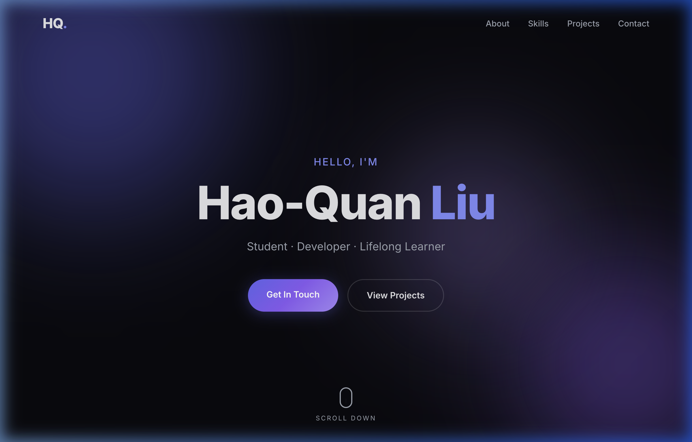

# 🌐 Hao-Quan Liu — Personal Website

A modern, single-page personal website built with pure **HTML** and **CSS**.

🔗 **Live Demo:** [https://nchu-student.github.io/0225/](https://nchu-student.github.io/0225/)



## ✨ Features

- **Dark premium theme** with animated gradient blobs and glassmorphism navigation
- **Responsive design** — looks great on desktop, tablet, and mobile
- **Smooth scroll navigation** with scroll-triggered fade-in animations
- **Five sections**: Hero, About, Skills, Projects, and Contact
- **Mobile hamburger menu** with slide-in panel
- **No frameworks required** — vanilla HTML, CSS, and JavaScript only

## 📂 Project Structure

```
.
├── index.html      # Main HTML page
├── style.css       # Stylesheet
├── screenshot.png  # Homepage screenshot
└── README.md       # This file
```

## 🛠 Tech Stack

| Technology | Purpose |
|------------|---------|
| HTML5 | Page structure & semantic markup |
| CSS3 | Styling, animations, responsive layout |
| JavaScript | Scroll effects, mobile nav toggle |
| Google Fonts | Inter typeface |

## 🚀 Getting Started

Simply open `index.html` in any modern web browser:

```bash
open index.html
```

No build step, no dependencies, no server needed.

## 📝 Customization

- **Contact info** — Update email, GitHub, and LinkedIn links in the Contact section of `index.html`
- **Profile photo** — Replace the `avatar-placeholder` div with an `` tag
- **Projects** — Edit the project cards in the Projects section to showcase your own work
- **Skills** — Add, remove, or modify skill cards in the Skills section

## 👤 Author

**Hao-Quan Liu** — National Chung Hsing University (國立中興大學)

---

© 2026 Hao-Quan Liu. Built with ❤️